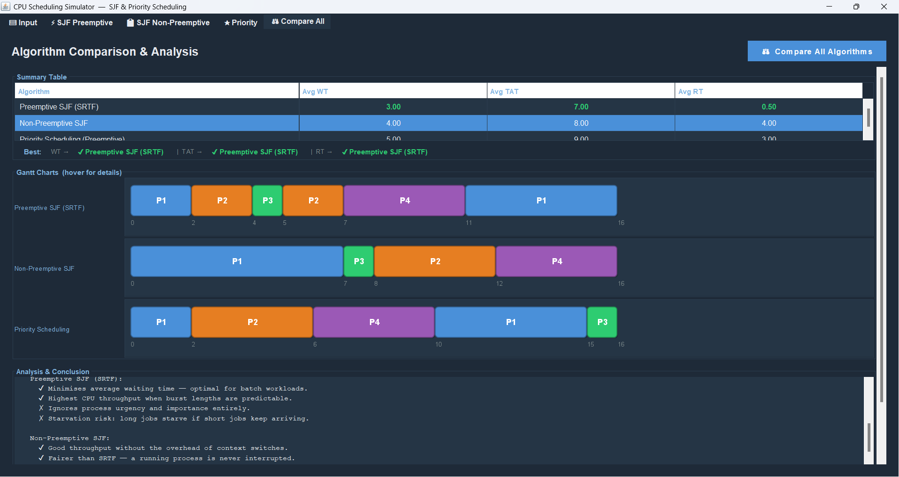

لا# CPU Scheduling Simulator — SJF vs Priority

## Overview

This project is an Operating Systems CPU Scheduling Simulator developed using Java Swing.

The application compares different CPU scheduling algorithms through an interactive graphical interface and visual Gantt charts.

The simulator focuses on analyzing the behavior, efficiency, fairness, and performance of:

* Preemptive SJF (SRTF)
* Non-Preemptive SJF
* Preemptive Priority Scheduling

The project was developed as part of an Operating Systems course project.

---

# Features

## Scheduling Algorithms

* Preemptive SJF (Shortest Remaining Time First)
* Non-Preemptive SJF
* Preemptive Priority Scheduling

---

## Metrics Calculation

The simulator calculates:

* Waiting Time (WT)
* Turnaround Time (TAT)
* Response Time (RT)
* Average WT
* Average TAT
* Average RT

---

## GUI Features

* Java Swing graphical interface
* Interactive process table
* Scenario loading buttons
* Validation and error handling
* Reset functionality
* Comparison panel
* Academic analysis section

---

## Visualization

* Separate Gantt charts for each algorithm
* Dynamic scheduling visualization
* Execution timeline rendering
* Process color mapping

---

# Technologies Used

* Java
* Java Swing
* Object-Oriented Programming (OOP)

---

# Project Structure

Main components of the project:

* Main_SJF.java
* Scheduling algorithms
* GUI panels
* Gantt chart renderer
* Scenario services
* Analysis services
* Validation logic

---

# Scheduling Algorithms

## 1. Preemptive SJF (SRTF)

The CPU always selects the process with the shortest remaining burst time.

If a shorter process arrives, the currently running process is preempted.

Advantages:

* Minimizes waiting time
* Improves efficiency

Disadvantages:

* May cause starvation
* Higher context switching

---

## 2. Non-Preemptive SJF

The shortest job is selected only when the CPU becomes free.

Advantages:

* Simpler implementation
* Lower context switching

Disadvantages:

* Slower response time
* Long processes may delay others

---

## 3. Preemptive Priority Scheduling

The CPU executes the process with the highest priority.

Lower priority number = higher priority.

Advantages:

* Suitable for urgent tasks
* Useful in real-time systems

Disadvantages:

* May cause starvation for low-priority processes

---

# Test Scenarios

The application includes predefined scenarios:

## Basic Mixed Workload

General scheduling behavior.

## Conflict Case

Demonstrates the conflict between:

* Short burst time
* High priority

## Starvation Case

Demonstrates starvation in Priority Scheduling.

## Validation Case

Tests invalid inputs and error handling.

---

# Assumptions

* Lower priority number means higher priority.
* CPU is single-core.
* Context switching overhead is ignored.
* All processes are CPU-bound.
* Arrival times and burst times are integers.

---

# Limitations

* Aging is not implemented.
* Multi-core scheduling is not supported.
* I/O burst simulation is not included.
* Real context-switch overhead is not simulated.

---

# Academic Analysis

Preemptive SJF achieved the lowest average waiting time and turnaround time because shorter processes are executed earlier.

Priority Scheduling performed better for urgent processes and real-time style workloads, but may lead to starvation for low-priority processes.

Non-Preemptive SJF is simpler and reduces context switching, but may increase response time compared to preemptive scheduling.

This project demonstrates the trade-off between:

* Efficiency (SJF)
* Urgency (Priority Scheduling)
* Fairness and starvation behavior

---

# Screenshots

---

# How to Run

1. Open the project in IntelliJ IDEA or any Java IDE.
2. Compile and run `Main_SJF.java`.
3. Add processes manually or load predefined scenarios.
4. Run any scheduling algorithm.
5. View metrics and Gantt charts.

---

# Future Improvements

Possible future enhancements:

* CSV file import/export
* Multi-core scheduling simulation
* Aging implementation
* Additional scheduling algorithms
* Export reports to PDF

---

# Team Members

1_Mohamed Adel Amin
2_Ahmed Nasr Mohamed
3_Adham Samir Haithm
4_Mohamed Mmdouh Ahmed
5_Yahia Zakaria Mohamed
6_Omar Mohmamed Ahmed
7_Ahmed Mmdouh

# Conclusion

This project successfully simulates and compares multiple CPU scheduling algorithms using an interactive Java Swing interface.

The simulator demonstrates important Operating Systems concepts including:

* CPU scheduling
* Process management
* Starvation
* Efficiency vs urgency
* Scheduling fairness

The project combines algorithm implementation, visualization, and academic analysis to provide a complete educational scheduling simulator.
